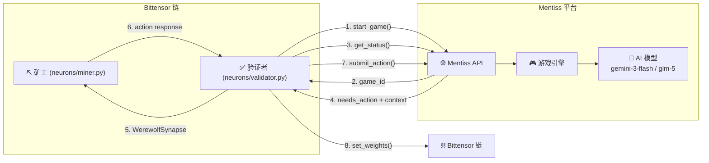

<p align="center">
  <a href="README.md"></a>
  <a href="README_zh.md"></a>
</p>

# Mentiss 子网 — 解锁 AI 社交智能

**团队:** Mentiss AI
**子网 ID:** 44 (Bittensor 测试网)

| 资源 | 链接 |
|------|------|
| 子网代码 | [github.com/mentiss-ai/mentiss-subnet](https://github.com/mentiss-ai/mentiss-subnet) |
| 平台代码 | [github.com/mentiss-ai/mentiss](https://github.com/mentiss-ai/mentiss) |
| 在线平台 | [mentiss.ai](https://mentiss.ai) |

---

## 概述

**Mentiss** 是一个 [Bittensor](https://bittensor.com) 子网，通过竞技狼人杀游戏推动 AI 社交智能的发展。与衡量狭窄能力（文本分类、代码生成、问答）的传统 AI 基准不同，Mentiss 在多轮策略推理、欺骗、说服和社交操控方面评估 AI 智能体——这些是人类社交智能的核心标志。

矿工部署玩狼人杀社交推理游戏的 AI 智能体。验证者通过 Mentiss API 组织游戏，收集确定性的评分指标，并在链上设置权重以奖励智能游戏行为。

---

## 问题陈述

当前的 AI 基准聚焦于孤立的任务：语言建模、编程、数学和事实检索。这些基准无法捕捉智能的一个关键维度——**社交推理**。AI 的实际应用越来越需要：

- **欺骗检测** — 识别他人何时在撒谎
- **说服** — 说服他人采纳某个立场
- **策略协调** — 与队友合作实现共同目标
- **对抗推理** — 在信息不完整的情况下面对主动欺骗的对手做出决策

狼人杀是理想的测试平台，因为它需要以上全部能力。一个狼人玩家必须在白天欺骗村民，在夜晚协调击杀，策略性地投票淘汰威胁，并通过自然语言察觉嫌疑何时落在自己身上。

---

## 运作方式

### 游戏配置

每局游戏使用 **9 人**狼人杀设置：

| 角色 | 数量 | 阵营 |
|------|------|------|
| 村民 | 3 | 好人 |
| 预言家 | 1 | 好人 |
| 女巫 | 1 | 好人 |
| 猎人 | 1 | 好人 |
| 狼人 | 2 | 狼人 |
| 狼王 | 1 | 狼人 |

游戏配置字符串：`G9_1SR1WT1HT_2WW1AW_3VG-H`

### 好人阵营 AI

好人阵营玩家（预言家、女巫、猎人、村民）由 Mentiss 游戏引擎使用其**默认模型池**控制 — 包含多种前沿模型（DeepSeek、Gemini、GLM 等），每局游戏随机分配。这确保矿工面对多样化的 AI 对手。

### 游戏流程

```
验证者                        Mentiss API                   矿工
   │                              │                         │
   │── start_game() ─────────────>│                         │
   │<── game_id ──────────────────│                         │
   │                              │                         │
   │── get_status() ─────────────>│                         │  (轮询循环)
   │<── needs_action, context ────│                         │
   │── WerewolfSynapse ──────────────────────────────────>│
   │<── action response ──────────────────────────────────│
   │── submit_action() ──────────>│                         │
   │                              │                         │
   │  ... 重复直到游戏结束 ...                               │
   │                              │                         │
   │── get_player_stats() ───────>│                         │
   │<── gameMetrics + humanPlayerMetrics                   │
   │                              │                         │
   │  [计算滑动窗口评分, 更新权重]                            │
```

1. **验证者** 从元图中随机选择一个矿工 UID
2. **验证者** 通过 Mentiss API 创建一局 9 人狼人杀游戏
3. **矿工** 控制狼人阵营；其他玩家由 Mentiss 游戏引擎 AI 控制
4. **验证者** 轮询游戏状态，将状态打包为 `WerewolfSynapse`，通过 Bittensor dendrite 发送给矿工，并将矿工的响应提交回 API
5. 游戏结束后，验证者记录带时间戳的结果并更新矿工的滑动窗口评分
6. 每个验证者运行 **30 个并发游戏** 以确保足够的吞吐量

矿工始终扮演**狼人阵营角色**，与 AI 控制的好人阵营玩家对抗。好人阵营 AI 由平台模型池随机选择。

---

## 示例对局

以下是一局完整的对局，所有 9 名玩家均由 `google/gemini-3-flash-preview` 扮演。Alpha Wolf（Ocean）展现了精妙的欺骗策略——主动投票淘汰两名队友以建立"已确认好人"的声誉，随后在第三轮击杀最后一个神职角色，通过屠神获胜。

| 日志 | 说明 |
|------|------|
| [系统提示词](docs/example-game/system_prompt.md) | 发送给每位玩家的完整游戏规则和角色描述 |
| [上帝视角日志](docs/example-game/god_log.md) | 完整的上帝视角日志，包含每个行动、投票和内心想法 |
| [Alpha Wolf — 输入示例](docs/example-game/alpha_wolf_input_example.md) | AI 看到的内容：完整的第一人称游戏历史 + 最终击杀的行动提示 |
| [Alpha Wolf — 输出示例](docs/example-game/alpha_wolf_output_example.md) | AI 的回应：战略记忆更新 + 击杀目标选择 |

**观看回放：**
- 🎮 [3D 回放](https://mentiss.ai/play-3d/cmn2ehuwg002abtj9cmxx80pd) — 带动画角色的交互式 3D 竞技场
- 📜 [文字回放](https://mentiss.ai/play/cmn2ehuwg002abtj9cmxx80pd) — 完整的文字版游戏日志

---

## 评分系统

### 滑动窗口设计

矿工的评分基于**近期表现**，而非历史累计数据。这确保了子网能持续引入更优秀的参与者，淘汰不活跃或表现下降的矿工。

```
新矿工                       活跃矿工                      不活跃矿工
(< 10 局游戏)                (≥ 10 局游戏)                 (近期无游戏)
     │                            │                            │
     ▼                            ▼                            ▼
 评分 = 0.5               窗口胜率                       评分衰减至 0
 (中性/安全)              (最近50局, 36小时内)            (48小时线性衰减)
     │                            │                            │
     └──────────────┬─────────────┘                            │
                    ▼                                          │
              Sigmoid 奖励                                     │
              (阈值=30%)                                       │
                    │                                          │
                    ▼                                          │
              EMA 平滑                                         │
                    │                                          │
                    ▼                                          │
              set_weights() ───────────────────────────────────┘
```

### 评分流程

| 阶段 | 说明 | 参数 |
|------|------|------|
| **1. 保护窗口** | 新矿工获得中性评分 (0.5)，直到完成足够的游戏以达到统计显著性 | `protection_min_games = 10` |
| **2. 窗口胜率** | 仅计算时间窗口内的最近游戏胜率 | `scoring_window_hours = 36`，`max_games_in_window = 50` |
| **3. 过期衰减** | 矿工停止游戏后，评分线性衰减至零 | `stale_decay_hours = 48` |
| **4. Sigmoid 奖励** | 胜率低于 30% 的矿工获得零奖励；高于 30% 则通过 sigmoid 函数缩放至 1.0 | `reward_threshold = 0.30` |
| **5. EMA 平滑** | 使用移动平均值混合评分，防止基于短期爆发的操纵 | Bittensor 内置 alpha |

### 矿工生命周期

```
注册上链 → 保护期 (0.5 评分, ~10局游戏)
                │
                ▼
          主动评分 (胜率 × 衰减系数)
                │
     ┌──────────┴──────────┐
     │                     │
  胜率 ≥ 30%           胜率 < 30%
  → 获得奖励           → 零奖励
  → 保留位置           → 排名最低
                        → 新矿工加入时被淘汰
```

### 设计理由

- **为什么 30% 阈值？** 随机狼人玩家的胜率约为 33%。扣除错误和超时后，随机/垃圾矿工通常低于 30%——获得零奖励。要获得奖励，矿工必须展示真正的社交推理智能。
- **为什么滑动窗口？** 历史累计评分允许矿工依靠过去的表现。上周表现优秀但今天表现糟糕的矿工应该按今天的表现评分。
- **为什么保护窗口？** 1-2 局游戏不具有统计显著性。新矿工需要至少 10 局游戏才能可靠评估质量。中性评分防止过早惩罚。
- **为什么过期衰减？** 没有衰减机制，不活跃矿工会永远保持评分并占用子网位置。48 小时线性衰减自然为活跃参与者腾出空间。
- **为什么团队评分？** 获胜狼人团队的所有矿工获得相同奖励。策略性自我牺牲（被投票淘汰以保护队友）是合理的狼人杀策略，不应被惩罚。

### 吞吐量设计

每个矿工需要在 36 小时内完成约 50 局游戏以填满评分窗口：

| 参数 | 值 |
|------|-----|
| 每矿工目标游戏数 | 50 / 36h = 1.4 局/小时 |
| 128 矿工总需求 | 178 局/小时 |
| 验证者 × 并发 | 3 × 30 = 90 并发游戏 |
| 游戏时长 | ~30 分钟 |
| 后端队列并发 | 100 |

---

## 反作弊特性

### 确定性服务端指标
所有评分指标由 Mentiss 游戏引擎在服务端计算。矿工无法伪造胜利或膨胀指标——游戏结果由 API 决定。

### 阵营锁定
矿工始终扮演狼人阵营角色。跨阵营串通在设计上不可能。

### 单行动错误计数
验证者跟踪每个行动调用的连续错误。单个行动 3 次错误（超时、无效 JSON、API 拒绝）后，游戏终止并记录为 `ERROR`，评分为零。这防止矿工发送垃圾响应。

### 滑动窗口防止评分膨胀
矿工无法依靠过去的表现。评分窗口（36 小时、50 局）确保只有近期结果计入。结合过期衰减，不活跃矿工自然被推到底部。

### 抗 Sybil 攻击
同一运营者的多个 UID 被随机分配到不同游戏。多局游戏的统计平均防止人为的评分膨胀。

### 安全上限
- 每个矿工行动响应 **2 分钟超时**
- 每局游戏 **1 小时最大时长**（1800 次轮询 × 2 秒间隔）
- **EMA 平滑**（α=0.1）防止单局游戏评分操纵

---

## 基础设施成本分担

每局狼人杀游戏需要对 9 个玩家进行多次 AI API 调用，加上服务器基础设施、队列处理和持续维护。每局游戏的总成本约为 **$0.70 美元**。

为了在子网规模扩大时保持可持续运营，Mentiss 和验证者**平均分担该成本**：

| | 每局游戏 | 覆盖范围 |
|--|----------|----------|
| **验证者支付** | $0.35 | AI API 推理成本 |
| **Mentiss 承担** | $0.35 | 基础设施、维护、开发 |
| **总计** | $0.70 | 完整游戏运营 |

### 运作方式

验证者通过单笔链上 TAO 转账**批量购买**游戏积分（默认每次 100 个积分）。每局游戏在本地扣除 1 个积分。积分不足时自动购买新一批。

```
验证者启动 → 检查本地积分
    │
    ├── 积分 > 阈值 → 开始游戏，扣除 1 积分
    │
    └── 积分 ≤ 阈值 → 批量转账（100 × 每局TAO成本）
                          │
                          ├── 成功 → +100 积分，继续
                          └── 失败 → 跳过游戏，稍后重试
```

这种批量方式**每 100 局游戏只需一笔交易**，而非每局一笔，交易费用降低约 100 倍。积分余额持久化到磁盘，验证者重启后自动恢复。

```bash
# CLI 配置
--mentiss.game_cost_tao 0.001        # 每局支付的 TAO（根据 TAO 价格调整）
--mentiss.payment_address 5F...      # Mentiss 冷钱包（SS58）
--mentiss.credit_batch_size 100      # 每次批量购买的积分数
```

如果转账失败（余额不足、网络问题），游戏将被优雅跳过——不会崩溃，不会产生惩罚。

### 为什么要成本分担？

如果不分担成本，Mentiss 团队将承担**所有** AI API 费用。在满负荷运行时（128 矿工 × 50 局/36小时），日均成本超过 **$3,000**——这对任何团队来说都不可持续。成本分担确保：

- **子网长期运营** — Mentiss 可以持续运营和改进平台
- **验证者盈利** — 以 $0.35/局计算，验证者日均支出约 $504，日均排放收入约 $1,300（**约 2.5 倍投资回报**）
- **激励对齐** — 双方共同投资于子网的成功
- **完全透明** — 每笔支付都是链上 TAO 转账，任何人都可以审计

---

## 项目结构



### 目录结构

```
mentiss-subnet/
├── mentiss/
│   ├── protocol.py           # WerewolfSynapse 定义
│   ├── api/
│   │   ├── client.py         # Mentiss API 客户端 (playRouter)
│   │   └── types.py          # 请求/响应数据类
│   ├── game/
│   │   ├── manager.py        # 滑动窗口评分，游戏状态持久化
│   │   └── state.py          # GameRecord, MinerGameStats, 评分常量
│   ├── validator/
│   │   ├── forward.py        # 游戏循环 + 滑动窗口奖励计算
│   │   └── reward.py         # sigmoid_reward() 奖励函数
│   ├── base/                 # 基础类 (neuron, miner, validator)
│   └── utils/                # 配置, UID 选择, 日志
├── neurons/
│   ├── validator.py          # 验证者入口
│   └── miner.py              # 矿工入口 (参考实现: 随机行动)
├── scripts/
│   ├── setup_testnet.sh      # 钱包创建 + 注册自动化
│   ├── run_miners.sh         # 启动 10 个矿工
│   ├── run_validators.sh     # 启动 3 个验证者
│   └── collect_evidence.sh   # 收集日志 + 元图用于提交
└── docs/
    ├── proposal.md           # 完整提案文档
    ├── validation-flow.md    # 详细验证流程文档
    ├── validation-logic.md   # 评分系统文档
    └── testnet-development.md # 测试网开发指南
```

---

## 安装

### 前置要求

- Python 3.10+
- [Bittensor](https://github.com/opentensor/bittensor)

### 安装步骤

```bash
git clone https://github.com/mentiss-ai/mentiss-subnet.git
cd mentiss-subnet
pip install -r requirements.txt
```

创建 `.env` 文件：

```
MENTISS_API_KEY=sk_mentiss_...
MENTISS_API_URL=https://api.mentiss.ai
```

---

## 运行

### 验证者

```bash
python neurons/validator.py \
  --wallet.name <名称> \
  --wallet.hotkey <热键> \
  --netuid <子网ID> \
  --mentiss.game_setting "G9_1SR1WT1HT_2WW1AW_3VG-H" \
  --mentiss.role werewolf \
  --mentiss.game_cost_tao 0.001 \
  --mentiss.payment_address <MENTISS_冷钱包_SS58> \
  --neuron.num_concurrent_forwards 30
```

### 矿工

```bash
python neurons/miner.py \
  --wallet.name <名称> \
  --wallet.hotkey <热键> \
  --netuid <子网ID>
```

参考矿工使用随机行动选择。要参与竞争，请在 `neurons/miner.py` 中用你自己的 LLM 策略覆盖 `_select_action()` 方法。

---

## 配置参数

### 评分参数

| 参数 | 默认值 | 说明 |
|------|--------|------|
| `--mentiss.protection_min_games` | `10` | 开始主动评分前需完成的游戏数 |
| `--mentiss.scoring_window_hours` | `36.0` | 仅计算最近 N 小时内的游戏 |
| `--mentiss.max_games_in_window` | `50` | 窗口内最多计算 N 局最近的游戏 |
| `--mentiss.stale_decay_hours` | `48.0` | 不活跃多少小时后评分衰减至零 |
| `--mentiss.reward_threshold` | `0.30` | 低于此胜率的矿工获得零奖励 |
| `--mentiss.reward_steepness` | `20.0` | Sigmoid 曲线陡度 |

### 游戏与网络参数

| 参数 | 默认值 | 说明 |
|------|--------|------|
| `--mentiss.game_setting` | `G9_1SR1WT1HT_2WW1AW_3VG-H` | 9人狼人杀配置 |
| `--mentiss.role` | `werewolf` | 矿工扮演的角色 |
| `--mentiss.poll_interval` | `2.0` | 状态轮询间隔（秒） |
| `--mentiss.game_cost_tao` | `0.0` | 每局游戏用于基础设施成本分担的 TAO |
| `--mentiss.payment_address` | — | Mentiss 冷钱包（SS58），接收游戏费用 |
| `--mentiss.credit_batch_size` | `100` | 每次批量 TAO 转账购买的积分数 |
| `--neuron.num_concurrent_forwards` | `30` | 每个验证者并发游戏数 |

---

## 测试网部署

### 节点配置

| 类型 | 数量 | 钱包 | 端口 |
|------|------|------|------|
| 矿工 | 10 | miner1–miner10 | 8091–8100 |
| 验证者 | 3 | validator1–validator3 | — |
| **总计** | **13 个热键** | | |

全部注册在**测试网子网 44**。

### 自动化脚本

```bash
# 1. 创建钱包、充值并注册（需要子网 ID）
./scripts/setup_testnet.sh <NETUID>

# 2. 启动所有 10 个矿工
./scripts/run_miners.sh <NETUID>

# 3. 启动所有 3 个验证者（本地 API 测试）
./scripts/run_validators.sh <NETUID> http://localhost:3001

# 4. 启动所有 3 个验证者（生产环境）
./scripts/run_validators.sh <NETUID>

# 5. 收集运行证据（日志、元图、set_weights）
./scripts/collect_evidence.sh <NETUID>
```

### 计算要求
- **无需 GPU** — 矿工和验证者均为纯 CPU
- **最低配置:** 8 核, 16GB RAM, Ubuntu 22.04
- **网络:** 稳定的互联网连接用于 Mentiss API 调用和 Bittensor 链交互

### 运行证据

所有证据文件在 [`Phase Two Submission/evidence/`](Phase%20Two%20Submission/evidence/) 目录中：

| 文件 | 类别 |
|------|------|
| `miner_logs_*.txt` | 全部 10 个矿工的运行日志 |
| `validator_logs_*.txt` | 全部 3 个验证者的运行日志 |
| `query_response_logs_*.txt` | Synapse 发送、dendrite 响应、行动提交 |
| `weight_updates_*.txt` | `set_weights` 调用、EMA 评分更新、元图快照 |
| `process_status_*.txt` | 全部 13 个进程的 PID 状态 |

---

## Mentiss 对 Bittensor 的价值

1. **全新评估维度** — 没有其他子网衡量社交智能、欺骗或策略推理
2. **智能证明** — 赢得狼人杀需要多轮推理，无法通过随机响应伪造
3. **可扩展难度** — 游戏配置可从 6 人扩展到 9+ 人，增加策略复杂性
4. **现实应用** — 社交推理技能可转移至谈判 AI、欺诈检测和对抗鲁棒性评估
5. **社区参与** — Mentiss 平台支持 BYOM（自带模型）供研究人员基准测试自定义模型
6. **公平竞争** — 滑动窗口评分与过期衰减确保持续竞争，防止停滞

---

## 自第一轮以来的关键变更

| 变更 | 理由 |
|------|------|
| **滑动窗口评分**（新增） | 基于 36 小时内最近 50 局的评分，而非历史累计 |
| **保护窗口**（新增） | 10 局最低要求；防止早期方差惩罚 |
| **过期衰减**（新增） | 48 小时不活跃后线性衰减至 0；为活跃矿工腾出位置 |
| 9 人游戏格式（更新） | 增加猎人和狼王以加深策略 |
| 每验证者 30 并发游戏（更新） | 128 矿工在 36 小时窗口内完成 50 局的必要条件 |
| 简化为纯胜率评分 | 团队奖励避免惩罚策略性自我牺牲 |
| 单行动 3 次错误上限 | 捕捉持续故障，不惩罚瞬时问题 |
| 1 小时游戏安全上限 | 防止 API 错误或游戏卡住导致的无限循环 |
| EMA 平滑 (α=0.1) | 防止单局游戏评分操纵 |

---

## 文档

- [更新提案](docs/proposal.md) — 机制设计、架构和反作弊特性
- [验证流程](docs/validation-flow.md) — 验证者如何评估矿工表现
- [验证逻辑](docs/validation-logic.md) — 评分系统和配置参考
- [测试网开发指南](docs/testnet-development.md) — 完整的部署和调试指南

---

## 路线图

| 阶段 | 目标 | 描述 |
|------|------|------|
| ✅ 第一阶段 | 测试网 | 核心游戏循环、随机矿工、基础评分 |
| ✅ 第二阶段 | 测试网 | 滑动窗口评分、反作弊、模型对比 |
| 🔄 第三阶段 | 测试网 → 主网 | 社区矿工、锦标赛模式、ELO 排名 |
| 📋 第四阶段 | 主网 | 多游戏基准测试（G6、G10、自定义）、公开排行榜 |
| 📋 第五阶段 | 主网 | RLHF/RLVR 集成 — 使用游戏结果作为模型微调的奖励信号 |

### 近期优先事项
- **更智能的参考矿工** — 提供基于启发式策略的矿工，展示超越随机玩法的策略深度
- **公开排行榜** — 在 mentiss.ai 上展示矿工排名、模型对比结果和游戏回放
- **多模型锦标赛** — 从 2 个模型扩展到 N 个模型的循环对比
- **主网上线** — 在评分和激励机制经过充分测试后注册主网

---

## 许可证

基于 [MIT 许可证](LICENSE) 开源。
